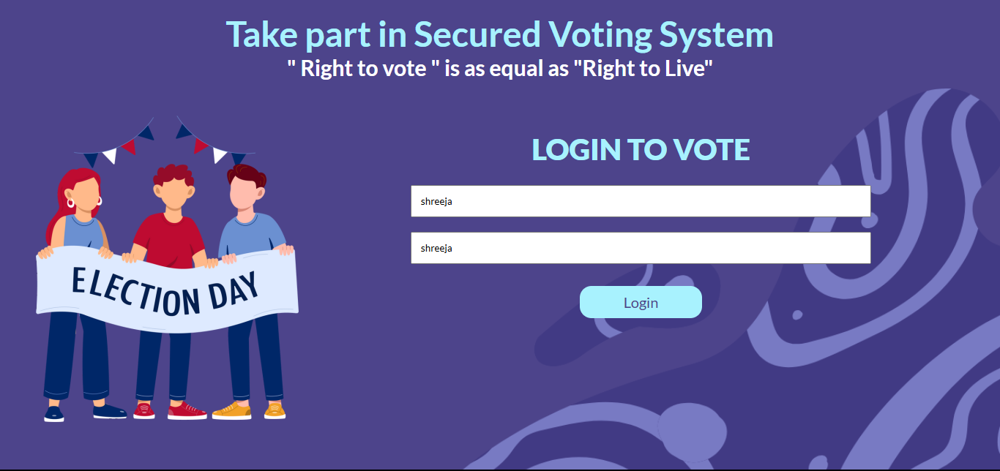
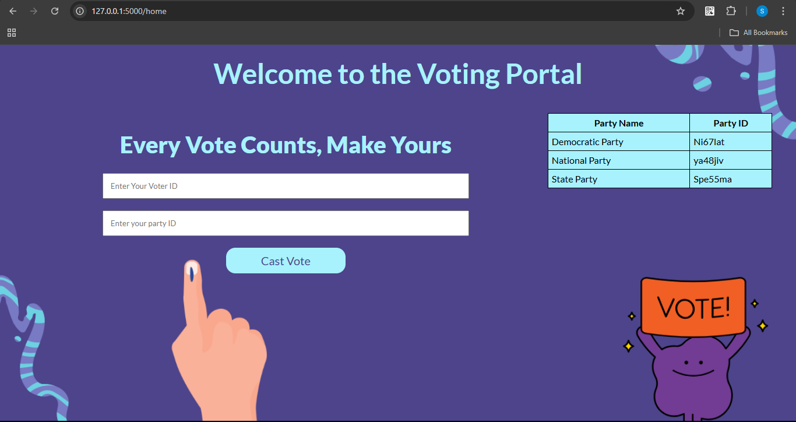
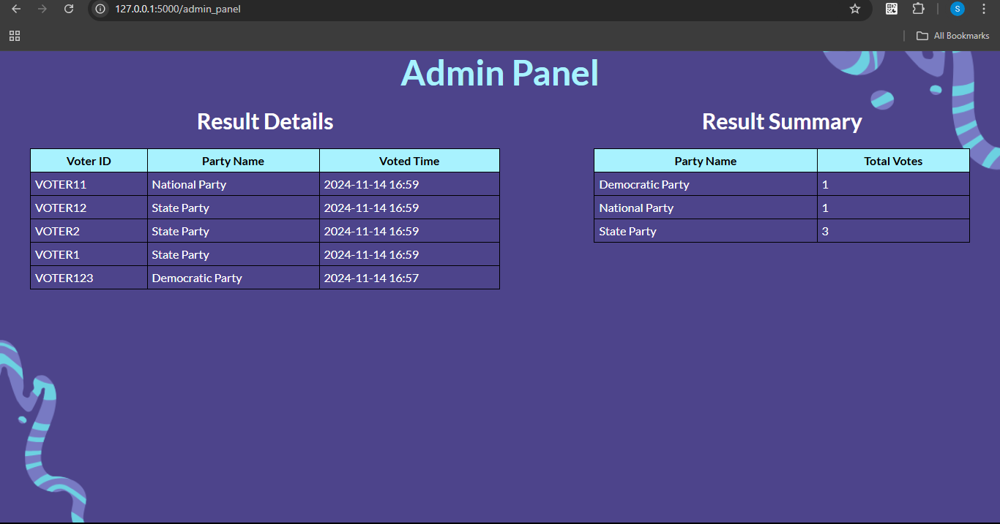

# Secured-voting-system-using-blockchain






# Blockchain Voting System

### Summary

A decentralized voting system built on a blockchain to ensure transparency, security, and immutability in voting records. This system allows multiple nodes to cast votes, share blockchain updates, and achieve consensus, making it ideal for secure online voting applications. The project initially integrated MongoDB to store voter information but has been modified to use static data for local testing and ease of setup.

---

### Features

- **Decentralized Network**: Operates across multiple nodes, ensuring no single point of failure.
- **Immutable Ledger**: All votes are securely stored on a blockchain, making records tamper-resistant.
- **Automatic Peer Discovery**: Each node can register with existing nodes, forming a connected network.
- **Consensus Mechanism**: Nodes validate and synchronize with the longest blockchain to ensure consistency.
- **RESTful API**: Interact with the voting system via HTTP endpoints for easy integration and testing.
- **MongoDB (Optional)**: Initially used for voter information storage, now replaced with static data for local testing.

---

### Technology Used

- **Python**: Core language for building the application logic.
- **Flask**: Lightweight web framework to handle API requests.
- **MongoDB (Optional)**: Initially integrated for storing voter information.
- **Postman**: Tool for testing API endpoints.
- **JSON**: Data format for data exchange across nodes.

---

### To Run This App, Follow the Steps Below

1. **Clone the repository** from GitHub:
   ```bash
   git clone https://github.com/SHREEJK/Secured-voting-system-using-blockchain.git
   
2. **Install dependencies:
   ```bash
   pip install -r requirements.txt
   
3. **Run the server:
   ```bash
   python startserver.py
   
4. **Run the application (use new terminal):
   ```bash
   python app.py

### How It Works

- **Network Registration**: Each node joins the network by registering with an existing node. The network grows as nodes register each other as peers.

- **Casting a Vote**: A user sends a vote request to any node. The node creates a transaction for this vote and adds it to the current transactions list.

- **Mining the Block**: When a block is mined, the node adds all current transactions (votes) to the new block. The block is then appended to the blockchain.

- **Broadcasting the Blockchain**: After a new block is mined, the node broadcasts the updated blockchain to all peers, ensuring each node holds the same record of votes.

- **Consensus Mechanism**: Each node periodically checks for the longest blockchain across the network, ensuring that all nodes maintain the latest and most valid blockchain.

- **Data Integrity**: The blockchain’s immutability ensures that all votes are securely stored and cannot be tampered with, providing transparency and trustworthiness to the voting process.

   

